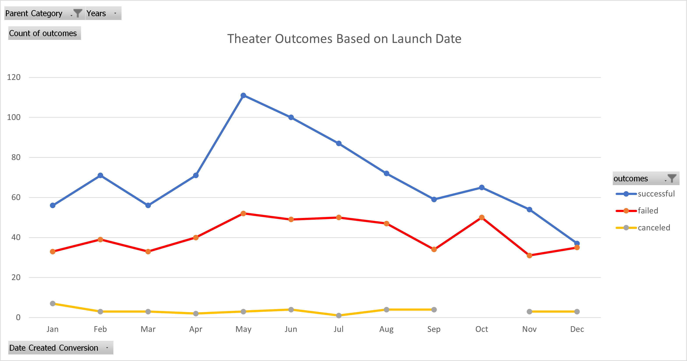
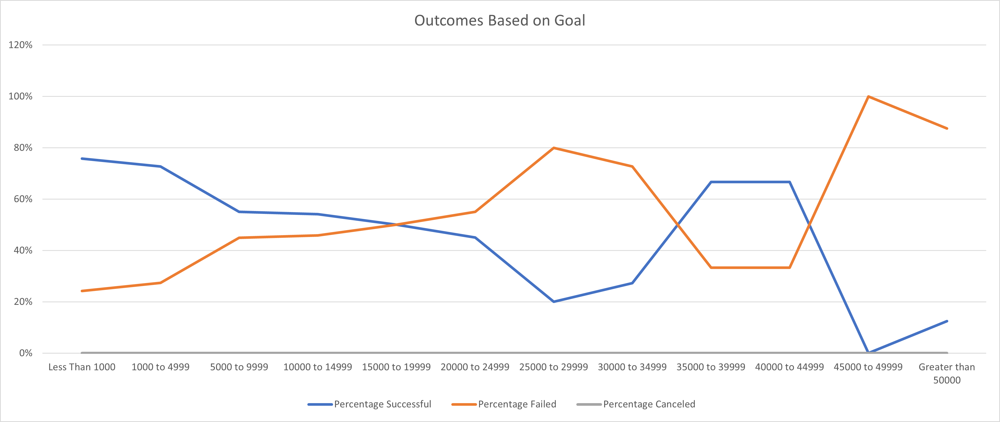

# Kickstarting with Excel

## Overview of Project
In this project our goal is to provide helpful information to a hypothetical client - Louise - who is looking to fund her play using Kickstarter.

### Purpose
This project explores pre-collected Kickstarter data in hopes of uncovering what factors most affect the likelihood of success for plays being Kickstarted.

## Analysis and Challenges

### Analysis of Outcomes Based on Launch Date
In the below image you can see that theater outcomes do their best in the summer time, especially May. However, if a project is launched in the winter it's likelihood of success is significantly lower.

### Analysis of Outcomes Based on Goals
Our second requested analysis is the outcome of a project based on its funding goal. In the below image we can see that plays with lower goals tend to succeed more often then not up until their goal hits $15,000. At this point the project has a 50/50 chance of success, however this will continue to decrease the higher the funding goal is.

### Challenges and Difficulties Encountered
The primary challenge of this exercise was the need to take the data given and expand upon it in order to have something easier to work with. To be more specific one challenge was the parent category and subcategory being listed together. In order to fix this we had to use built-in Excel functions to delimit the data and split it into two seperate columns. Additionally the time provided was in a format hard to work with, so to rectify this we wrote a mathematical formula that changed it into a format that Excel could easily format.

## Results

- What are two conclusions you can draw about the Outcomes based on Launch Date?
That May, followed by summer time is the best time to launch a project. Winter time is the worst time to launch.

- What can you conclude about the Outcomes based on Goals?
The higher the goal, the less likely the outcome will be success.

- What are some limitations of this dataset?
The size of our dataset with only plays is 1066, while this isn't bad more would be better. Additionally the data included doesn't include factors such as marketing and the social following a project had prior to being launched on Kickstarter. There could be major difference between a brand new team trying to launch a $50,000 project versus an experienced team which has previously kickstarted projects and is now attempting a larger project.

- What are some other possible tables and/or graphs that we could create?
With this dataset the possibilities of different tables and graphs are innumerable. We could do this analysis on every different subcategory, we could dive deeper into origin country relating to launch dates, explore how being spotlighed or staff picked determined success, and many other things.